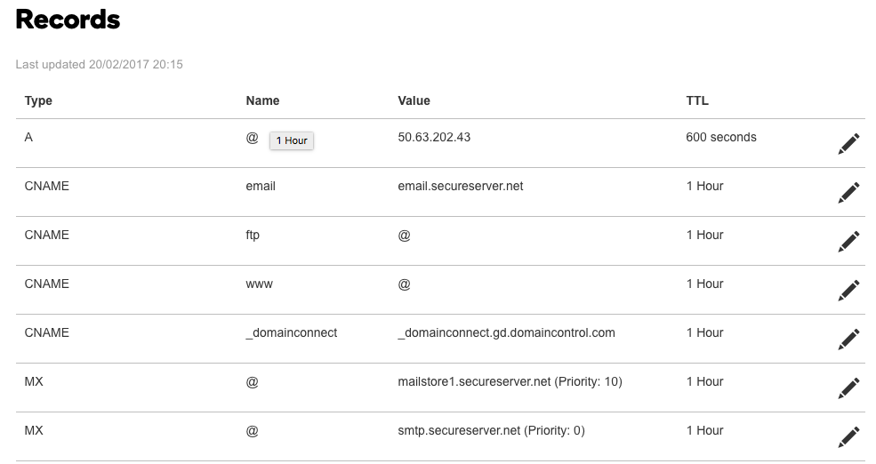
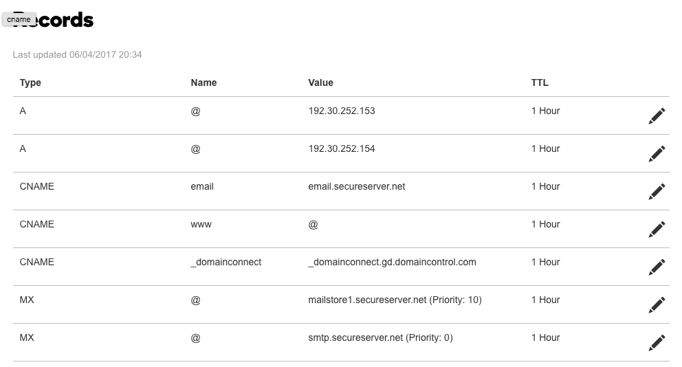

# KLB Property Services

## Hosting on Github

See [Github](https://pages.github.com/).


## Getting the domain name

Add a `CNAME` to the root of the folder containing the custom domain name.

Manage the DNS via [GoDaddy](https://dcc.godaddy.com) DNS Management. See up `A` names for `192.30.252.153` and `192.30.252.154`.

Turn this:




Into this:




See [Github](https://help.github.com/articles/using-a-custom-domain-with-github-pages/)

## Email Forwarding

See [this post](https://tjkelly.com/blog/gmail-godaddy-email-forwarding/)

## Source

The site is based on [Design Studio 1-Page Template](https://github.com/website-templates/design-studio_one-page-template.git) which was forked and pushed to the `template` branch.

Basic development lifecycle is to checkout the branch into one folder and develop using `gulp` etc. Then once built (`gulp rebuild`), copy the artifacts in the `build` folder to another checkout version of `master`. 

Never attempt to merge the two branches!

```
cd klbproperty-branch
gulp build
cd ../klbproperty
cp -r ../klbproperty-branch/build/static/ static/
cp ../klbproperty-branch/build/home.html ./index.html
```

To get the `template` branch building (as per [Design Studio 1-Page Template](https://github.com/website-templates/design-studio_one-page-template.git)) try randomly running these commands.

```
npm install gulp
npm install
gulp install
gulp dev
```
